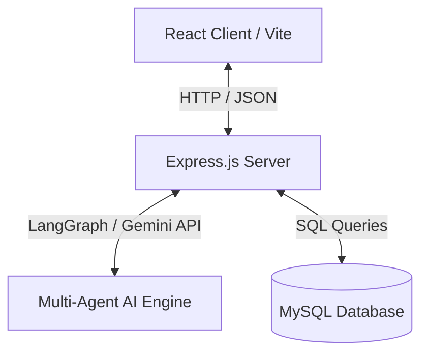

# AlphaLens AI - Multi-Agent Investment Intelligence Platform

AlphaLens AI is an investment research and analysis platform powered by a collaborative multi-agent AI system. It automates equity research, runs financial simulations, tracks portfolios/watchlists, and provides interactive what-if laboratories to model corporate performance.

---

## 🌟 Key Features

*   **Mission Control**: Real-time status monitor of the AI Research Pipeline execution logs, CPU loads, and active AI nodes.
*   **Market Analysis**: Comprehensive equity research reports including financial indicators, dynamic competency spider graphs, news feeds, and AI-generated investment summaries.
*   **AI Autocomplete Search**: Interactive ticker search covering Indian and global exchanges, showing country flag badges, exchange indicators, and search history preservation.
*   **What-If Lab**: Proactive simulation tool with sliders to adjust Revenue, Profit Margins, Revenue Growth, Interest Rates, and Inflation to calculate derived financial metrics (P/E ratio, price targets, competency scores, and future projections).
*   **Portfolio & Watchlist Manager**: Save analysed stocks, track weights, manage positions, and preserve search history.
*   **Unified Design System**: A dark mode UI with glassmorphism, responsive navigation sidebar, dynamic animations, and a standardized footer layout across all pages.

---

## 🏗️ Architecture Overview

AlphaLens AI is built using a decoupled client-server architecture:



### 1. Frontend (`/frontend`)
*   **React 19** & **Vite**: Client framework and component rendering.
*   **React Router v7**: Declarative routing for single-page navigation.
*   **Recharts**: Custom responsive charts (Spider / Radar graphs, Line projection charts).
*   **CSS Variables & Theme**: Custom CSS variables for animations, dark mode colors, glassmorphic styling, and flex-layouts.

### 2. Backend (`/backend`)
*   **Node.js & Express.js**: REST API server handling autocomplete, simulation logic, portfolio storage, and database persistence.
*   **LangGraph & LangChain**: Manages stateful, multi-agent LLM workflows using Google Gemini models.
*   **MySQL**: Relational database for storing portfolios, watchlists, search history, and analysis records.

---

## 🤖 Multi-Agent AI Engine

The platform utilizes a multi-agent intelligence engine for equity analysis. The system is built using **LangChain.js** (handling prompt templates, model interactions, and structured output parsing) and orchestrated via **LangGraph.js** to manage state transitions across sequential nodes:

1.  **Ticker Validator Agent**: Confirms the ticker and resolves correct exchange information.
2.  **Financial Collector Agent**: Queries balance sheets, cash flows, and key valuation multiples.
3.  **News Intelligence Agent**: Aggregates news sentiment, media articles, and market headlines.
4.  **Competency Evaluator Agent**: Scores the stock across key dimensions (Growth, Value, Capital Efficiency, etc.) for the radar graph.
5.  **Investment Analyst Agent**: Synthesizes all metrics to output a final conviction rating (Buy/Hold/Sell) and a comprehensive summary.

---

## 🚀 Quick Start Guide

### Prerequisites
*   [Node.js](https://nodejs.org/) (v18+)
*   [MySQL](https://www.mysql.com/) database server
*   [Google Gemini API Key](https://ai.google.dev/) (for agent analysis execution)

---

### Database Setup

1. Create a MySQL database named `alphalens`:
   ```sql
   CREATE DATABASE alphalens;
   ```
2. Configure credentials in the backend environment file.

---

### Installation & Execution

#### 1. Backend Setup
Navigate to the backend directory, install packages, and create your `.env` configuration:
```bash
cd backend
npm install
```

Create a `.env` file based on `.env.example`:
```env
PORT=5000
DB_HOST=localhost
DB_USER=your_db_user
DB_PASS=your_db_password
DB_NAME=alphalens
GEMINI_API_KEY=your_gemini_api_key
```

Run the backend server in development mode:
```bash
npm run dev
```

#### 2. Frontend Setup
Open a new terminal window, navigate to the frontend directory, and run the development server:
```bash
cd frontend
npm install
npm run dev
```

The frontend application will be running locally at `http://localhost:5173`.

---

## 📁 Repository Structure

```
AlphaLens/
├── backend/
│   ├── agents/          # LangGraph Multi-Agent configurations & node states
│   ├── controllers/     # Express route handlers (analysis, simulation, watchlist)
│   ├── database/        # Database pool connections, schema.sql, & JSON database connection
│   ├── routes/          # Express route declarations (analysis, simulation, watchlist)
│   ├── server.js        # Entry point for backend
│   └── package.json
├── frontend/
│   ├── src/
│   │   ├── components/  # Reusable UI components (Navbar, Sidebar, Footer, Radar, ShaderCanvas)
│   │   ├── pages/       # Page views (Dashboard, CompanyAnalysis, SimulationLab, Portfolio)
│   │   ├── services/    # API request configurations (Axios)
│   │   ├── styles/      # Styling stylesheets (Navbar, Sidebar, Dashboard)
│   │   └── App.jsx      # Root routing configuration
│   └── package.json
└── README.md            # You are here
```

---

## 🔒 License
This project is proprietary and intended for demonstration and research purposes.
