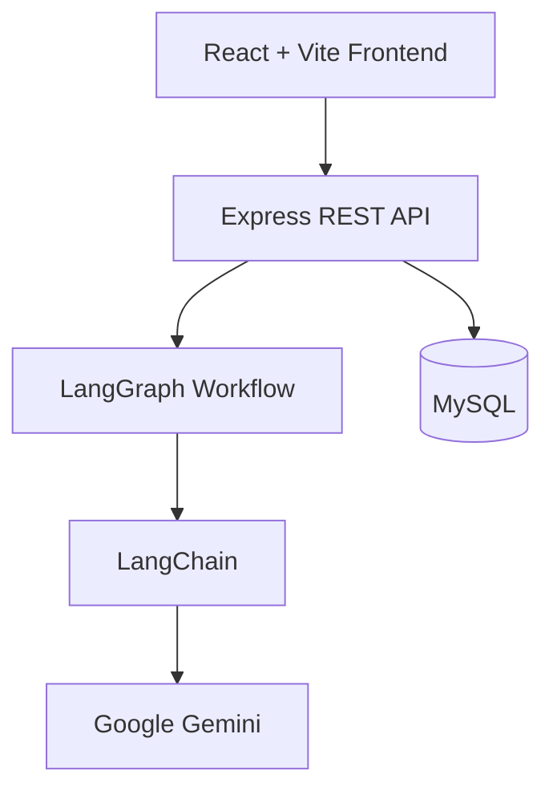

# 🚀 AlphaLens AI – Multi-Agent Investment Intelligence Platform

> **AI-powered investment research platform built with React, Node.js, Express, MySQL, LangChain.js, and LangGraph.js.**
>
> AlphaLens AI automates equity research, performs financial simulations, analyzes company fundamentals, generates AI-powered investment reports, tracks portfolios & watchlists, and enables interactive what-if financial modeling.

---

## 🌐 Live Demo

### Frontend
**https://alpha-lens-investment.vercel.app/**

### Backend API
**https://alphalens-backend-ubiu.onrender.com**

### GitHub Repository
**https://github.com/adeshsonawane46/AlphaLens**

---

# 📖 Overview

AlphaLens AI is a Multi-Agent Investment Intelligence Platform that automates equity research using specialized AI agents. The platform collects financial data, analyzes market news, evaluates company fundamentals, performs interactive financial simulations, and generates AI-powered Buy, Hold, or Sell recommendations.

Built with React, Node.js, Express.js, MySQL, LangChain.js, and LangGraph.js, the system demonstrates how multiple AI agents can collaborate to produce structured investment insights. Each agent is responsible for a specific task, and together they create a comprehensive investment report through an orchestrated workflow.

---

# ✨ Features

## 📊 AI Market Analysis

- AI-generated equity research
- Financial ratio analysis
- Revenue growth visualization
- Profitability metrics
- Valuation indicators
- Dynamic Competency Spider Graph
- Buy / Hold / Sell recommendation
- Latest company news
- AI investment summary

---

## 🤖 Multi-Agent AI Pipeline

During the **Running AI Agents** stage, AlphaLens AI uses **LangGraph.js** to orchestrate a committee of specialized AI agents. Each agent contributes a different perspective before producing the final recommendation.

### AI Committee

- ✅ Planner Agent – Coordinates the analysis workflow.
- ✅ Analyst Agent – Evaluates financial fundamentals and valuation metrics.
- ✅ News Agent – Analyzes recent news and market sentiment.
- ✅ Bull Agent – Identifies positive investment opportunities and growth catalysts.
- ✅ Bear Agent – Identifies risks and downside factors.
- ✅ Critic Agent – Reviews and validates all findings.
- ✅ Judge Agent – Combines all insights to generate the final Buy, Hold, or Sell recommendation with a confidence score.

This layered approach improves transparency, explainability, and the overall quality of the investment analysis.

---

## 🔬 What-If Lab

Interactive simulation platform allowing users to modify

- Revenue
- Revenue Growth
- Profit Margin
- Interest Rate
- Inflation

The system automatically recalculates

- Projected Revenue
- EPS
- P/E Ratio
- Fair Price
- Competency Score
- Future Growth Projection

---

## 📈 Portfolio Management

- Save favorite companies
- Create watchlists
- Portfolio allocation
- Investment tracking
- Search history
- Company bookmarks

---

## 🎯 Mission Control Dashboard

Real-time monitoring dashboard displaying

- AI pipeline execution
- Active AI agents
- CPU utilization
- System status
- Live execution logs

---

## 🔍 Smart Company Search

- AI autocomplete
- NSE support
- BSE support
- International exchanges
- Country flags
- Recent search history

---

## 🎨 Modern UI

- Glassmorphism design
- Dark theme
- Responsive layout
- Sidebar navigation
- Animated dashboards
- Mobile friendly
- Interactive charts

---

# 🏗 Architecture



---

# ⚙ Tech Stack

## Frontend

- React 19
- Vite
- React Router v7
- Recharts
- Axios
- CSS3

---

## Backend

- Node.js
- Express.js
- MySQL
- LangChain.js
- LangGraph.js
- Google Gemini API
- TWELVE DATA API

---

## Database

- MySQL

---

## Deployment

Frontend

- Vercel

Backend

- Render

---

# 🤖 AI Workflow

```text
              User Search
                   │
                   ▼
    ┌────────────────────────────┐
    │ 1. Research Started        │
    └─────────────┬──────────────┘
                  ▼
    ┌────────────────────────────┐
    │ 2. Finding Company         │
    └─────────────┬──────────────┘
                  ▼
    ┌────────────────────────────┐
    │ 3. Detecting Exchange      │
    └─────────────┬──────────────┘
                  ▼
    ┌─────────────────────────────┐
    │ 4. Fetching Live Market Data│
    └─────────────┬───────────────┘
                  ▼
    ┌────────────────────────────┐
    │ 5. Collecting Financials   │
    └─────────────┬──────────────┘
                  ▼
    ┌────────────────────────────┐
    │ 6. Fetching News           │
    └─────────────┬──────────────┘
                  ▼
    ┌────────────────────────────┐
    │ 7. Analyzing Competitors   │
    └─────────────┬──────────────┘
                  ▼
    ┌────────────────────────────┐
    │ 8. Running AI Agents       │
    └─────────────┬──────────────┘
                  ▼
    ┌────────────────────────────┐
    │ 9. Generating AI Report    │
    └─────────────┬──────────────┘
                  ▼
    ┌────────────────────────────┐
    │ 10. Completed              │
    └────────────────────────────┘
```

---

# ⚡ How It Works

The investment analysis process follows a sequential multi-agent workflow:

1. **Company Search** – The user searches for a publicly listed company.

2. **Ticker Validator Agent** – Validates the company name and retrieves the correct market ticker.

3. **Financial Data Collector Agent** – Collects financial statements, profitability metrics, valuation ratios, revenue growth, and other company fundamentals.

4. **News Intelligence Agent** – Retrieves and summarizes recent company-related news and evaluates overall market sentiment.

5. **Competency Evaluation Agent** – Scores the company's financial health and competitive strength using predefined evaluation criteria.

6. **Investment Analyst Agent** – Combines the outputs from all previous agents, reasons over the collected information using Gemini AI, and generates a final investment recommendation.

7. **Final Report Generation** – The system presents a detailed investment report, including company metrics, charts, AI-generated insights, and a Buy, Hold, or Sell recommendation.

---

# 📂 Project Structure

```
AlphaLens
│
├── backend
│   ├── agents
│   ├── controllers
│   ├── database
│   ├── routes
│   ├── services
│   ├── utils
│   ├── server.js
│   └── package.json
│
├── frontend
│   ├── public
│   ├── src
│   │
│   ├── components
│   ├── pages
│   ├── services
│   ├── styles
│   ├── assets
│   ├── App.jsx
│   └── main.jsx
│
├── ARCHITECTURE.md
└── README.md
```

---

# 🚀 Getting Started

## Clone Repository

```bash
git clone https://github.com/adeshsonawane46/AlphaLens.git

cd AlphaLens
```

---

# Backend Setup

```bash
cd backend

npm install
```

Create a `.env` file inside the backend folder:

```env
PORT=5000

DB_HOST=localhost
DB_USER=your_username
DB_PASSWORD=your_password
DB_NAME=alphalens
DB_PORT=3306

GEMINI_API_KEY=your_gemini_api_key
TWELVE_DATA_API_KEY=your_twelve_data_api_key
```

Run the backend:

```bash
npm run dev
```

---

# Frontend Setup

```bash
cd frontend

npm install

npm run dev
```

Application:

```
http://localhost:5173
```

---

# Database Setup

Create the database:

```sql
CREATE DATABASE alphalens;
```

Import the provided SQL schema into the database.

---

# Frontend Environment Variables

Create a `.env` file inside the frontend folder:

```env
VITE_API_URL=http://localhost:5000
```

---

# API Endpoints

## Analysis

```
GET /api/analysis
```

---

## Simulation

```
POST /api/simulation
```

---

## Portfolio

```
GET /api/portfolio
```

---

## Watchlist

```
GET /api/watchlist
```

---

# ⚖️ Key Decisions & Trade-offs

## Design Decisions

### Multi-Agent Architecture
Instead of using a single AI prompt, the application follows a modular multi-agent architecture using LangGraph.js. Each AI agent is responsible for a dedicated task, making the system easier to extend, debug, and maintain.

### React + Vite
React with Vite was selected to provide a fast development experience, efficient hot module replacement, and optimized production builds.

### MySQL Database
A relational database was chosen to store user data, portfolio information, watchlists, and analysis history in a structured and reliable manner.

### Google Gemini AI
Google Gemini powers the reasoning and report generation by analyzing the outputs from all AI agents and generating clear investment insights and Buy/Hold/Sell recommendations.

### Twelve Data API
The Twelve Data API was selected as the primary source for financial market data. It provides company fundamentals, market metrics, historical price data, and other financial information required by the AI agents. Using a dedicated financial data provider ensures consistent and structured market information for the analysis workflow.

---

## Trade-offs

- The project currently uses a single large language model (Google Gemini) instead of multiple AI models to keep the architecture simpler and easier to maintain.
- Financial data depends on the Twelve Data API, so analysis is subject to API rate limits and service availability.
- Authentication and multi-user collaboration were intentionally kept minimal to prioritize the core AI investment analysis workflow.
- Real-time streaming responses and live WebSocket updates were not implemented to reduce system complexity and focus on reliable report generation.
- Advanced portfolio optimization and automated trading features were intentionally left out to keep the project focused on AI-powered investment research.

---

# Deployment

## Frontend

Hosted on

**Vercel**

https://alpha-lens-investment.vercel.app/

---

## Backend

Hosted on

**Render**

https://alphalens-backend-ubiu.onrender.com

---

# 📊 Example Runs

## Example 1 — Reliance Industries Ltd.

**Company:** Reliance Industries Ltd. (NSE: RELIANCE)

**Recommendation:** ⭐ Strong Buy

**AlphaLens Score:** 91 / 100

**Confidence:** 89%

**Investment Horizon:** Medium

**Risk Level:** Medium-Low

### Executive Summary

Reliance Industries received a **Strong Buy** recommendation from the AlphaLens AI Committee. The platform identified strong long-term growth potential driven by its diversified businesses in telecom, retail, and energy. Financial health, growth prospects, and technical indicators contributed to a high consensus score.

### Key Investment Drivers

- Consumer moat through Jio and Reliance Retail.
- Strong long-term growth from clean energy initiatives.
- Healthy financial fundamentals and diversified revenue streams.

### Identified Risks

- High capital expenditure may impact free cash flow.
- Earnings remain exposed to refining margin volatility.

---

## Example 2 — NESTLEIND Corporation

**Company:** NESTLEIND Corporation (BSE: NESTLEIND)

**Recommendation:** 🟡 Hold

**AlphaLens Score:** 67 / 100

**Confidence:** 90%

**Investment Horizon:** Short

**Risk Level:** Low

### Executive Summary

The AlphaLens AI Committee assigned a **Hold** recommendation for NESTLEIND Corporation. The company demonstrates disciplined capital management and consistent financial performance; however, the current valuation appears balanced and limited short-term growth catalysts lead the AI to recommend maintaining existing positions rather than increasing exposure. :contentReference[oaicite:0]{index=0}

### Key Investment Drivers

- Strong contract pipeline supporting future revenue visibility.
- Healthy return ratios and disciplined capital allocation.
- Low overall investment risk with stable financial performance.

### Identified Risks

- Macroeconomic slowdown may reduce enterprise spending.
- Margin pressure from rising operating and talent costs.

---

## Example 3 — Wipro Ltd.

**Company:** Wipro Ltd. (NSE: WIPRO)

**Recommendation:** 🔴 Strong Sell

**AlphaLens Score:** 42 / 100

**Confidence:** 86%

**Investment Horizon:** Long

**Risk Level:** High

### Executive Summary

AlphaLens AI generated a **Strong Sell** recommendation for Wipro. Despite a healthy contract pipeline and efficient capital allocation, the platform identified significant long-term risks including slowing enterprise technology spending, operating margin pressure, and macroeconomic uncertainty, resulting in a weak investment outlook. :contentReference[oaicite:1]{index=1}

### Key Investment Drivers

- Strong enterprise digital transformation pipeline.
- Robust balance sheet and return on equity.

### Identified Risks

- Macroeconomic slowdown impacting enterprise IT budgets.
- Margin pressure from rising talent acquisition and retention costs.

---

# Future Improvements

- Authentication
- Real-time stock prices
- Portfolio analytics
- AI chatbot
- Email alerts
- PDF report generation
- Risk prediction
- Cloud deployment
- Docker support
- CI/CD pipeline

---

# Author

**Adesh Sonawane**

GitHub

https://github.com/adeshsonawane46

---

# License

This project is intended for educational, research, and portfolio demonstration purposes.

---

## ⭐ If you like this project, don't forget to star the repository!