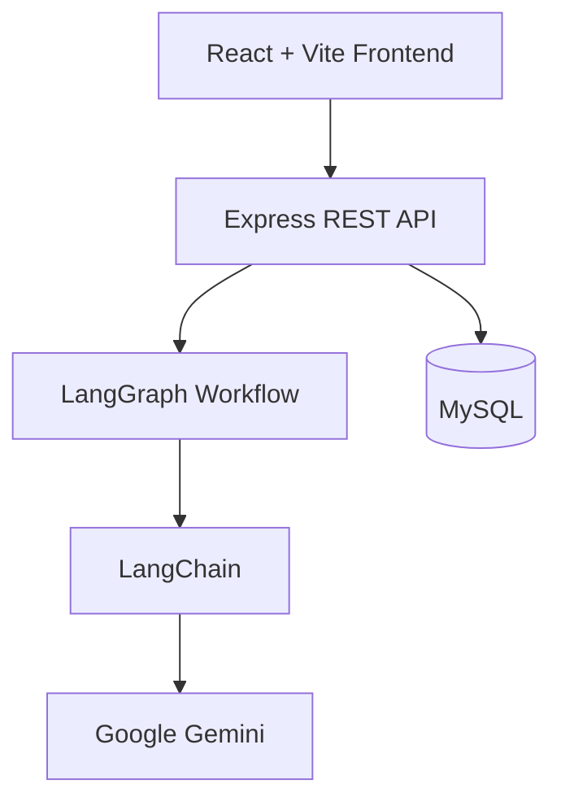

# 🚀 AlphaLens AI – Multi-Agent Investment Intelligence Platform

> **AI-powered investment research platform built with React, Node.js, Express, MySQL, LangChain.js, and LangGraph.js.**
>
> AlphaLens AI automates equity research, performs financial simulations, analyzes company fundamentals, generates AI-powered investment reports, tracks portfolios & watchlists, and enables interactive what-if financial modeling.

---

## 🌐 Live Demo

### Frontend
**https://alpha-lens-investment.vercel.app/**

### Backend API
**https://alphalens-backend-ubiu.onrender.com**

### GitHub Repository
**https://github.com/adeshsonawane46/AlphaLens**

---

# ✨ Features

## 📊 AI Market Analysis

- AI-generated equity research
- Financial ratio analysis
- Revenue growth visualization
- Profitability metrics
- Valuation indicators
- Dynamic Competency Spider Graph
- Buy / Hold / Sell recommendation
- Latest company news
- AI investment summary

---

## 🤖 Multi-Agent AI Pipeline

The platform uses **LangGraph.js** to orchestrate multiple AI agents.

Agents include:

- ✅ Ticker Validator Agent
- ✅ Financial Data Collector Agent
- ✅ News Intelligence Agent
- ✅ Competency Evaluation Agent
- ✅ Investment Analyst Agent

Each agent performs an independent task before passing information to the next node.

---

## 🔬 What-If Lab

Interactive simulation platform allowing users to modify

- Revenue
- Revenue Growth
- Profit Margin
- Interest Rate
- Inflation

The system automatically recalculates

- Projected Revenue
- EPS
- P/E Ratio
- Fair Price
- Competency Score
- Future Growth Projection

---

## 📈 Portfolio Management

- Save favorite companies
- Create watchlists
- Portfolio allocation
- Investment tracking
- Search history
- Company bookmarks

---

## 🎯 Mission Control Dashboard

Real-time monitoring dashboard displaying

- AI pipeline execution
- Active AI agents
- CPU utilization
- System status
- Live execution logs

---

## 🔍 Smart Company Search

- AI autocomplete
- NSE support
- BSE support
- International exchanges
- Country flags
- Recent search history

---

## 🎨 Modern UI

- Glassmorphism design
- Dark theme
- Responsive layout
- Sidebar navigation
- Animated dashboards
- Mobile friendly
- Interactive charts

---

# 🏗 Architecture



---

# ⚙ Tech Stack

## Frontend

- React 19
- Vite
- React Router v7
- Recharts
- Axios
- CSS3

---

## Backend

- Node.js
- Express.js
- MySQL
- LangChain.js
- LangGraph.js
- Google Gemini API

---

## Database

- MySQL

---

## Deployment

Frontend

- Vercel

Backend

- Render

---

# 🤖 AI Workflow

```
User Search
      │
      ▼
Ticker Validator
      │
      ▼
Financial Collector
      │
      ▼
News Intelligence
      │
      ▼
Competency Evaluation
      │
      ▼
Investment Analyst
      │
      ▼
Final AI Report
```

---

# 📂 Project Structure

```
AlphaLens
│
├── backend
│   ├── agents
│   ├── controllers
│   ├── database
│   ├── routes
│   ├── services
│   ├── utils
│   ├── server.js
│   └── package.json
│
├── frontend
│   ├── public
│   ├── src
│   │
│   ├── components
│   ├── pages
│   ├── services
│   ├── styles
│   ├── assets
│   ├── App.jsx
│   └── main.jsx
│
└── README.md
```

---

# 🚀 Getting Started

## Clone Repository

```bash
git clone https://github.com/adeshsonawane46/AlphaLens.git

cd AlphaLens
```

---

# Backend Setup

```bash
cd backend

npm install
```

Create

```
.env
```

```env
PORT=5000

DB_HOST=localhost

DB_USER=your_username

DB_PASS=your_password

DB_NAME=alphalens

GEMINI_API_KEY=your_api_key
```

Run

```bash
npm run dev
```

---

# Frontend Setup

```bash
cd frontend

npm install

npm run dev
```

Application

```
http://localhost:5173
```

---

# Database Setup

Create database

```sql
CREATE DATABASE alphalens;
```

Import your schema.

---

# Environment Variables

Backend

```env
PORT=

DB_HOST=

DB_USER=

DB_PASS=

DB_NAME=

GEMINI_API_KEY=
```

Frontend

```env
VITE_API_URL=http://localhost:5000
```

---

# API Endpoints

## Analysis

```
GET /api/analysis
```

---

## Simulation

```
POST /api/simulation
```

---

## Portfolio

```
GET /api/portfolio
```

---

## Watchlist

```
GET /api/watchlist
```

---

# Deployment

## Frontend

Hosted on

**Vercel**

https://alpha-lens-investment.vercel.app/

---

## Backend

Hosted on

**Render**

https://alphalens-backend-ubiu.onrender.com

---

# Future Improvements

- Authentication
- Real-time stock prices
- Portfolio analytics
- AI chatbot
- Email alerts
- PDF report generation
- Risk prediction
- Cloud deployment
- Docker support
- CI/CD pipeline

---

# Author

**Adesh Sonawane**

GitHub

https://github.com/adeshsonawane46

---

# License

This project is intended for educational, research, and portfolio demonstration purposes.

---

## ⭐ If you like this project, don't forget to star the repository!